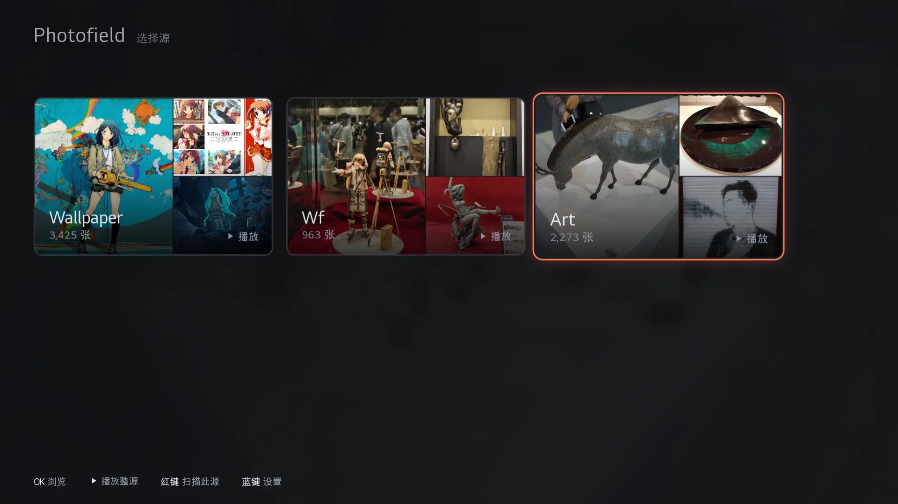
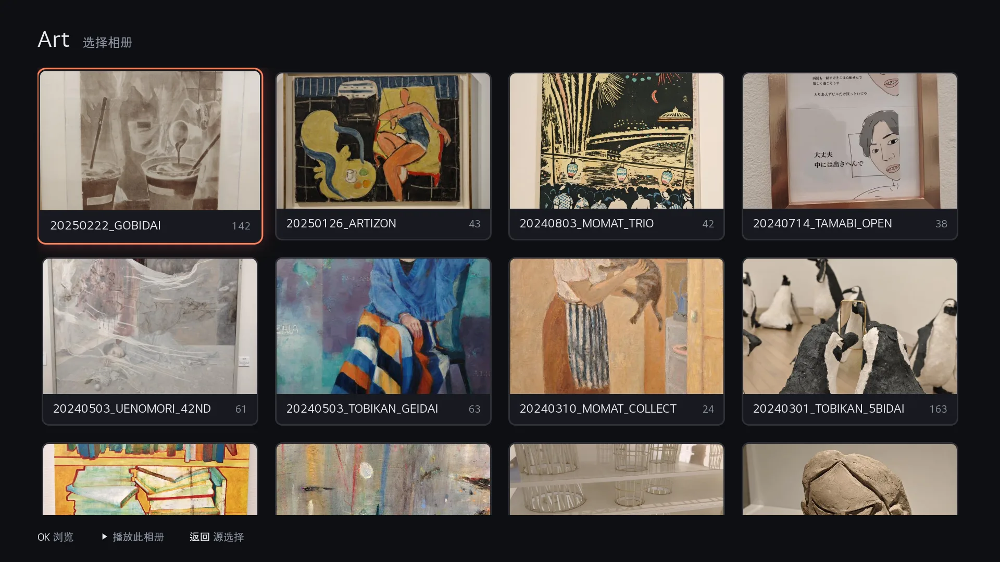
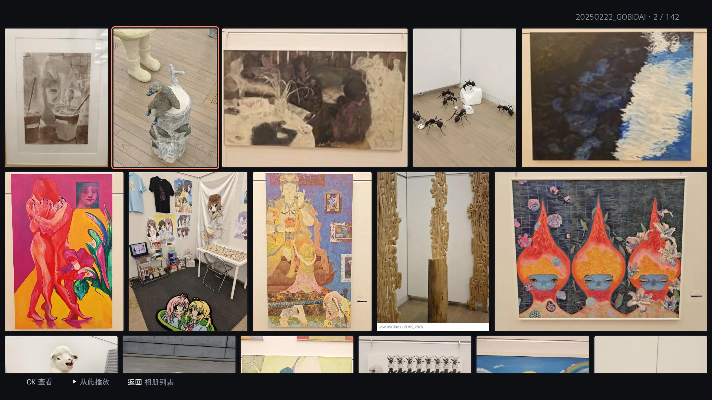
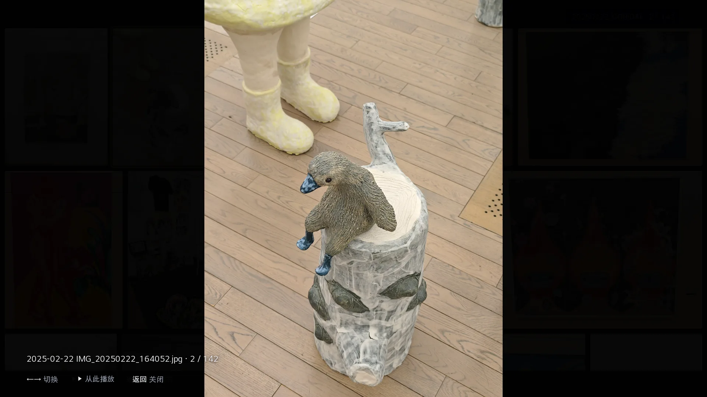
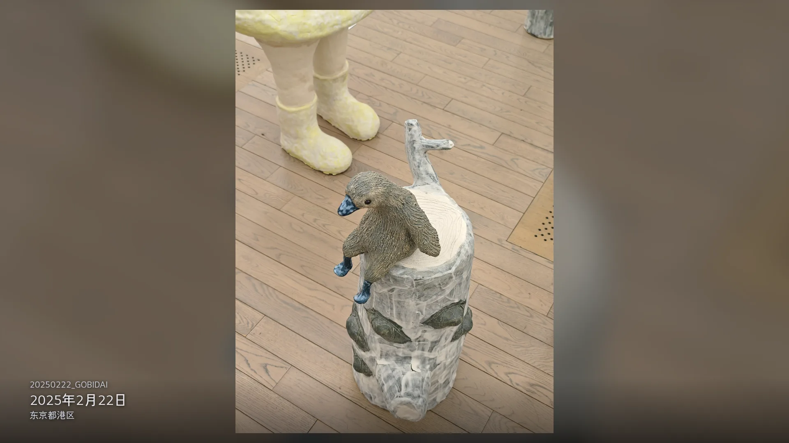
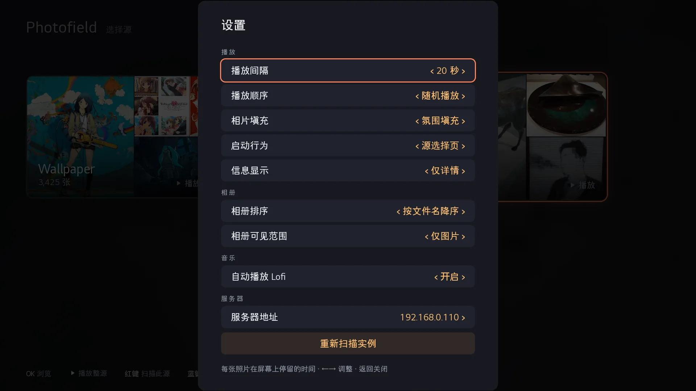

<!-- markdownlint-disable MD033 MD041 -->

<p align="center">
  
</p>

<h1 align="center">Photofield for webOS</h1>

<p align="center">
  <strong>面向 LG webOS 电视的 <a href="https://github.com/SmilyOrg/photofield">Photofield</a> 原生客户端</strong><br />
  照片源自动发现 · 相册浏览 · Kiosk 幻灯片 · 视频播放 · Lofi 背景音乐
</p>

<p align="center">
  <b>中文</b>
  &nbsp;·&nbsp;
  <a href="README.en.md"><b>English</b></a>
</p>

<p align="center">
  <a href="https://github.com/CheerChen/photofield-webos/stargazers"></a>
  <a href="https://github.com/CheerChen/photofield-webos/releases"></a>
  
  
  
  
  
</p>

---

## 项目展示

| 源选择 | 相册浏览 | 照片网格 |
| :---: | :---: | :---: |
|  |  |  |

| 全屏查看器 | 幻灯片 | 设置 |
| :---: | :---: | :---: |
|  |  |  |

---

## 这是什么

本仓库是 **[Photofield](https://github.com/SmilyOrg/photofield)** 在 **LG webOS 电视**上的专用客户端（非浏览器套壳）。

- 对接自托管的 Photofield 实例：自动发现照片源、浏览相册、全屏查看照片
- 为 TV UI 与遥控器 D-pad 设计焦点导航
- Kiosk 幻灯片模式：可配间隔、填充与顺序
- 内置一组 Lofi 背景音乐
- 照片与视频均走系统原生解码，**不需要 root**

客户端本身是空壳，**无内置照片源**。照片与视频需由你自己的 Photofield 实例提供。

当前版本详见 [Releases](https://github.com/CheerChen/photofield-webos/releases)。更新记录见 [CHANGELOG.zh-CN.md](CHANGELOG.zh-CN.md)。

---

## 功能特性

| 能力 | 说明 |
| --- | --- |
| 照片源自动发现 | 扫描已配置服务器的端口，以照片拼贴卡片显示并缓存发现的实例与扫描状态 |
| 相册浏览 | 四列封面卡片；子目录自动展开为独立相册 |
| 照片网格 | 按服务端 wall 布局排布；从任意照片直接开始幻灯片播放 |
| 查看器 | 全屏查看；加载期间继续导航时始终对齐最后一次输入 |
| 视频播放 | 查看器与幻灯片播放均以原始文件有声播放；无法解码时回退到已加载的预览图 |
| 幻灯片播放 | 可配播放间隔、填充模式和播放顺序；支持时钟、拍摄详情、地点解析与 Ken Burns 动效；播放期间抑制屏保 |
| Lofi 背景音乐 | 红、绿、黄、蓝键切换四组主题歌单，上、下键切歌；列表播完随机换组；可设进入 Kiosk 自动播放 |
| 遥控器导航 | D-pad / OK / 返回全覆盖；播放、暂停、快退、快进、停止等媒体键；彩键切换 Lofi 歌单 |
| 设置 | 启动行为、播放间隔、相片填充、播放顺序、信息显示、相册排序、媒体范围、Lofi 自动播放、服务器地址与实例重扫 |

---

## 要求

1. **LG webOS 电视**（开发者模式或已装 Homebrew Channel；root 非必须）
2. **已部署的 Photofield 实例**（提供照片与视频数据）
3. 电视与服务器网络可达（同局域网或可访问的域名 / IP）

服务端部署参见：[Photofield](https://github.com/SmilyOrg/photofield)

---

## 安装

### 开发者模式 / 手动 sideload

从 [Releases](https://github.com/CheerChen/photofield-webos/releases) 下载已构建 IPK，使用 LG 官方 `ares-install` 安装。

**已 root 电视（opkg 路径，绕过 appinstalld 解包失败）：**

将下方 `TV` 换成电视的局域网 IP，或本机 `~/.ssh/config` 中已配置的主机名。

```bash
scp com.cheerchen.photofield_*_all.ipk root@TV:/tmp/photofield.ipk
ssh root@TV 'opkg --add-dest developer:/media/developer install -d developer /tmp/photofield.ipk && \
          mkdir -p /media/developer/apps/usr/palm/applications/ && \
          cp -a /media/developer/usr/palm/applications/com.cheerchen.photofield \
                /media/developer/apps/usr/palm/applications/'
ssh root@TV 'sync; reboot'   # 首次安装需重启，sam 才会注册应用
```

也可本地打包（需要先初始化 [webos-tv-kit](https://github.com/CheerChen/webos-tv-kit) 子模块，
CDP 调试脚本也在其中）：

```bash
git submodule update --init   # 首次 clone 后执行一次
npm ci
./scripts/package.sh
# → com.cheerchen.photofield_<version>_all.ipk
```

---

## 快速开始

1. 安装并打开 **Photofield**
2. 应用自动扫描已配置服务器的 `8000–8010` 端口；默认服务器地址为 `192.168.0.110`，可在设置页修改并重新扫描
3. 源选择页用方向键切换，OK 浏览相册，播放键或绿键直接播放整个源
4. 相册内 OK 打开网格，再 OK 进入全屏查看器
5. Kiosk 播放中用彩键开关 Lofi 音乐，媒体键控制播放

---

## 技术栈

| 层级 | 选型 |
| --- | --- |
| 运行时 | webOS Web App (WAM / Chromium) |
| 语言 | 原生 JavaScript；esbuild 打包，无运行时第三方依赖 |
| UI | 遥控器焦点导航 + 栈式页面路由 |
| 图片加载 | 变体候选链回退 + 解码尺寸预算 |
| 播放 | 原生 `<video>` 硬件解码 |
| 服务协议 | Photofield HTTP API（scene / file 接口） |
| 本地数据 | `localStorage`（设置、PIN、源缓存） |
| 打包 | `ares-package` → IPK |

---

## 开发

```bash
# 安装开发依赖
npm ci

# 构建 dist/app.js
npm run build

# 构建检查 + ESLint + 单元测试
npm run check

# Playwright E2E 测试
npm run test:e2e

# 打 IPK（需要 ares-cli）
./scripts/package.sh
```

---

## 相关项目

- [Photofield](https://github.com/SmilyOrg/photofield) — 服务端 / Web 端
- [open-lofi](https://github.com/btahir/open-lofi) — Kiosk 内置 Lofi 曲目来源（CC0 公共领域）
- [webosbrew](https://github.com/webosbrew) — webOS 社区工具与应用仓库

---

## 免责声明

- 本项目为客户端壳，**不提供、不内置任何照片或视频资源**
- 使用者需自行部署 Photofield 并合法管理自己的媒体库，后果自负

---

## License

MIT。上游 Photofield 与第三方依赖遵循各自许可证。

---

## Star History

[](https://star-history.com/#CheerChen/photofield-webos&Date)
